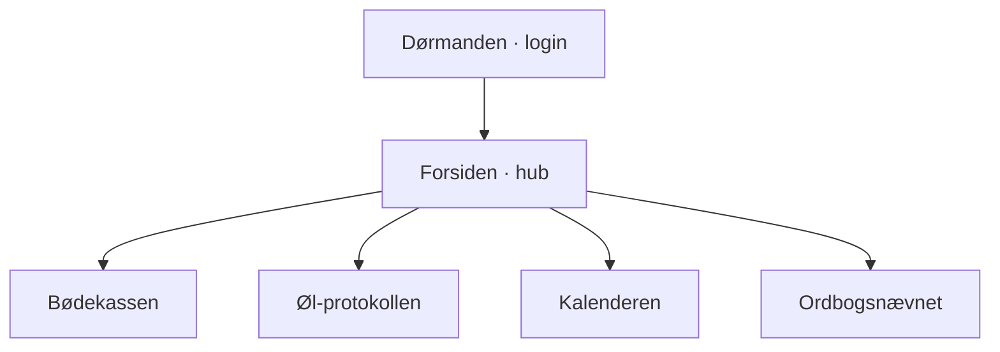

# De Fulde Fem — Sitemap & Blueprint

Forberedelse til en Claude Code-prompt. Dokumentet fastlægger **hvad** universet
skal bestå af — hvilke sider, hvad de skal kunne, og de faste rammer. **Hvordan**
det bygges (datamodel i Supabase, præcis UX, komponentopbygning, rækkefølge) er
op til Code. Mere frihed end grænser.

---

## Sitemap

- **Dørmanden** gater hele universet — ingen adgang uden login.
- **Forsiden** er knudepunktet: overblik plus indgang til de fire moduler.
- De fire moduler er sidestillede og tilgås fra forsiden og en fælles navigation.

---

## Blueprint

### 1. Dørmanden (login)
Adgangskontrol for de fem medlemmer.
- Log ind, så kun klubben har adgang.
- Holder styr på hvem der er logget ind, så bøder, øl m.m. kan knyttes til rette minister.

### 2. Forsiden (hub)
Samlet overblik over klubbens tilstand lige nu.
- De fem ministre med titler: Foreningssekretæren, Turistministeren, Bødekasseministeren, Finansministeren og Joy.
- Næste møde med dato, sted og tilmeldingssvar.
- Bødekasse-saldo.
- Øl-top-3.
- Ordbogsnævnets seneste domme.
- Indgang til alle moduler.

### 3. Bødekassen
Registrering og overblik over bøder samt klubbens økonomi.
- Registrér en bøde på et medlem med beløb og kendelse (begrundelse).
- Saldo og oversigt per medlem og samlet.
- Redigerbart bødekatalog (faste forseelser og takster).
- Ønskeliste — hvad kassen skal bruges på.
- Beregninger der erstatter Foreningssekretærens manuelle noter: hvem skylder hvad, totaler, automatisk.

### 4. Øl-protokollen
Logbog og scoreboard over drukne specialøl.
- »+«-flow til at registrere en øl (navn, evt. type/bryggeri, rating).
- Ratings og ranglister (øl-top).
- Øl organiseret i mapper pr. mødedato.

### 5. Kalenderen
Møder og weekendture.
- Kommende møder og ture med dato og sted.
- Tilmelding/svar per medlem.
- Arkiv over tidligere møder og ture.

### 6. Ordbogsnævnet (forbudte ord)
Forvaltning af forbudte og indstillede ord.
- Liste over ord med status: godkendt / afvist / frikendt.
- Domme med begrundelse.
- Regelsæt: et ord tjekkes mod DDO og Retskrivningsordbogen og er gyldigt dansk, hvis det står i mindst én af dem.
- Indstil nye ord til vurdering.

---

## De faste rammer

- **Stak:** vanilla HTML/CSS/JS — ingen frameworks, intet build-step.
- **Hosting:** GitHub Pages. Live i repoet, opdateres ved hver ændring.
- **Data:** Supabase (hosted Postgres + auto-genereret API) som delt datalag — alle fem tilgår samme data. Skriv ind og regn ud. JS-klient fra CDN.
- **Platform:** mobil-først.
- **Sprog & tone:** dansk, klubbens skæve humor i alle tekster. Knapper, fejlbeskeder og tomme tilstande må gerne være sjove og passe til universet — ministertitler, bøder, øl, fynsk stædighed.
- **Stil (låst):** B4 — »Forsamlingshuset ved Øhavet«. Håndskrift-logo og kondenseret grotesk, havblå/sand/koral palet, lyst. Skæve opslagstavle-detaljer: sedler hængt op med synlige nåle (1–4, skæve vinkler), et par nåle som øl-kapsler, én seddel tapet op med malertape, en ølbund-ring og et æseløre-hjørne hist og her. Joys seddel hænger i én enkelt nål.
- **Eksempeldata:** beløb og bøder er eksempeldata, indtil det rigtige bødekatalog leveres.
